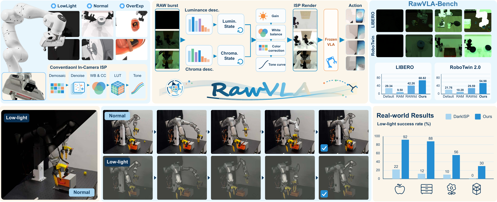

<div align="center">

<h1>RawVLA: Embodied Neural Image Signal Processor for Robotic Manipulation</h1>



<p>
  <a href="https://shuhongll.github.io/">Shuhong Liu</a><sup>1,2</sup>,
  Heng Zhou<sup>2</sup>, Lingfeng Qian<sup>2</sup>, Yuhao Fang<sup>2</sup>,
  Xianbao Hou<sup>2</sup>, Qianyu Zhou<sup>1</sup>,
  <a href="https://sites.google.com/view/linguedu/home">Lin Gu</a><sup>4</sup>,
  Wei Sui<sup>2</sup>, <a href="https://marsyang.site/">Jianfei Yang</a><sup>3</sup>,
  <a href="https://cuiziteng.github.io/">Ziteng Cui</a><sup>1,5</sup>
</p>

<p>
  <sup>1</sup>The University of Tokyo &nbsp;
  <sup>2</sup>D-Robotics &nbsp;
  <sup>3</sup>NTU &nbsp;
  <sup>4</sup>Tohoku University &nbsp;
  <sup>5</sup>HKUST(GZ)
</p>

<p>
  <a href="https://shuhongll.github.io/rawvla/"></a>
  <a href="https://arxiv.org/abs/2609.37530"></a>
  <a href="https://github.com/ShuhongLL/RawVLA"></a>
  <a href="https://huggingface.co/datasets/ToferFish/RawVLA-Bench"></a>
</p>

</div>

RAW-VLA is a streaming, illumination-adaptive RAW image frontend for
vision-language-action policies. This repository contains the RAW frontend,
StarVLA integration, RAWVLA-Bench lighting transforms, and LIBERO and RoboTwin
2.0 evaluation adapters.

## 📦 Installation

Clone the repository with its submodules:

```bash
git clone --recurse-submodules https://github.com/ShuhongLL/RawVLA.git
cd RawVLA
git submodule sync --recursive
git submodule update --init --recursive
```

Several project-maintained submodules are branches of this repository. Their
branch and pinned commit are documented in [SUBMODULES.md](SUBMODULES.md).

### Choose an environment

Install only the environment needed for your workflow:

| Benchmark | Training environment | Evaluation environment |
| --- | --- | --- |
| LIBERO | `environment-libero.yml` (`starvla-libero`) | `environment-libero.yml` (`starvla-libero`) |
| RoboTwin 2.0 | `environment-libero.yml` (`starvla-libero`) for RAW-VLA training | `environment-libero.yml` (`starvla-libero`) for the policy + `environment-robotwin2.yml` (`robotwin`) for the simulator |

The `robotwin` environment runs the simulator; RAW-VLA training for both
benchmarks uses the StarVLA environment. RoboTwin π0/π0.5 training recipes are
in [`configs/robotwin`](configs/robotwin/README.md).

Standalone OpenVLA-OFT and GR00T have separate, optional environments;
see [ENVIRONMENTS.md](ENVIRONMENTS.md) for their installation and validation.

### LIBERO and RAW-VLA

Use this environment for StarVLA/RAW-VLA training, LIBERO evaluation, and the
StarVLA policy server used alongside RoboTwin:

```bash
conda env create -f environment-libero.yml
conda activate starvla-libero
python -m pip install --no-deps --no-build-isolation -e ./third_party/LIBERO
python -m pip install --no-deps -e ./third_party/openvla-oft
python -m pip install --no-deps -e ./starVLA
export LIBERO_CONFIG_PATH="$PWD/.local/libero"
python scripts/setup/configure_libero.py
```

The last command writes ignored, machine-local simulator paths to
`.local/libero/config.yaml`. Versioned RAW-VLA training recipes are in
[`configs/libero`](configs/libero).

### RoboTwin 2.0

Install the simulator for evaluation in its own environment. The asset script
downloads the official assets unless you set `ROBOTWIN_ASSETS_SOURCE` to an
existing asset directory:

```bash
conda env create -f environment-robotwin2.yml
conda activate robotwin
bash scripts/setup/setup_robotwin_assets.sh
ROBOTWIN_PYTHON=python bash third_party/RoboTwin/script/_install.sh
```

Evaluation with a StarVLA policy server also uses the `starvla-libero`
environment above. See
[ENVIRONMENTS.md](ENVIRONMENTS.md) for interpreter selection, host-specific
graphics requirements, and validation commands.

## 🧠 VLA Checkpoints

Download the public StarVLA LIBERO checkpoints and their base models with:

```bash
python tools/checkpoints/download_starvla_libero.py
# Add --all for every listed model family.
python tools/checkpoints/validate_starvla_libero.py
```

Set `STARVLA_ROOT=/custom/path/to/starVLA` when the StarVLA checkout is not at
the repository default.

## 🗂️ RawVLA-Bench

The train and test resources are hosted separately: paired training
trajectories are on Hugging Face, while the frozen test/evaluation protocols
are JSON manifests in this GitHub repository. No pre-rendered test trajectories
are included in the Hugging Face dataset.

### Train: Paired Trajectories (Hugging Face)

The paired RAW/RGB training trajectories are available directly from
[RawVLA-Bench on Hugging Face](https://huggingface.co/datasets/ToferFish/RawVLA-Bench).
It contains 2,403 successful trajectories: 1,771 from LIBERO and 632 from
RoboTwin 2.0.

```bash
hf download ToferFish/RawVLA-Bench \
  --repo-type dataset \
  --local-dir benchmark_data/RawVLA-Bench
```

After downloading, the train files are located at:

- LIBERO: `benchmark_data/RawVLA-Bench/data/libero/raw/` and
  `benchmark_data/RawVLA-Bench/data/libero/rgb/`.
- RoboTwin 2.0: `benchmark_data/RawVLA-Bench/data/robotwin2/raw/` and
  `benchmark_data/RawVLA-Bench/data/robotwin2/rgb/`.

Optional data regeneration is documented in [replay/README.md](replay/README.md).

### Test: Evaluation Manifests (GitHub)

The test protocols are recorded in these frozen simulator rollout manifests:

- [LIBERO full evaluation](experiments/simulation/libero/manifests/libero_manifest_50_init_states_10000_rollouts.json):
  40 tasks × 50 initial states × 5 lighting domains = 10,000 rollouts.
- [LIBERO smaller evaluation](experiments/simulation/libero/manifests/libero_manifest_10_init_states_2000_rollouts.json):
  40 tasks × 10 initial states × 5 lighting domains = 2,000 rollouts.
- [RoboTwin 2.0 evaluation](experiments/simulation/robotwin/manifests/robotwin2_test_manifest_50_seeds_3250_rollouts.json):
  13 tasks × 50 seeds × 5 lighting domains = 3,250 rollouts.

The manifests specify task, seed, and lighting choices. The LIBERO runner
reads its manifest directly. The RoboTwin JSON documents the 3,250 benchmark
cases, but the RoboTwin runner shown below uses its own task list and
`easy`/`hard` settings; it does not execute those JSON entries automatically.
The example command below launches an evaluation, not the exact frozen
3,250-rollout protocol. During evaluation, the simulator renders observations
and the policy produces actions.

## 🏋️ Training

The paper's main RawVLA-Bench training recipes are:

| Benchmark | Frozen VLA backbone | RAW-VLA training config |
| --- | --- | --- |
| LIBERO | Qwen3-OFT | [`qwen3_oft.yaml`](configs/libero/qwen3_oft.yaml) |
| LIBERO | π0 | [`pi0.yaml`](configs/libero/pi0.yaml) |
| LIBERO | π0.5 | [`pi05.yaml`](configs/libero/pi05.yaml) |
| RoboTwin 2.0 | π0 | [`pi0.yaml`](configs/robotwin/pi0.yaml) |
| RoboTwin 2.0 | π0.5 | [`pi05.yaml`](configs/robotwin/pi05.yaml) |

The LIBERO recipes inherit [`rawvla_libero.yaml`](configs/base/rawvla_libero.yaml);
the RoboTwin recipes inherit [`rawvla_robotwin.yaml`](configs/base/rawvla_robotwin.yaml).
Both use the shared [`rawvla.yaml`](configs/base/rawvla.yaml) defaults.
For RoboTwin, prepare the frozen backbones with the
[`backbone guide`](experiments/simulation/robotwin/backbones/README.md) and set
`RAWVLA_MODEL_ROOT` and `RAWVLA_TOKENIZER_PATH` as described in the
[`RoboTwin training guide`](configs/robotwin/README.md).
Additional experimental LIBERO recipes are in
[`configs/libero/optional`](configs/libero/optional/README.md).

For example, train Qwen3-OFT on the published LIBERO trajectories:

```bash
export RAWVLA_ROOT="$PWD"
export LIBERO_CONFIG_PATH="$RAWVLA_ROOT/.local/libero"
conda activate starvla-libero
cd starVLA
accelerate launch --num_processes 1 \
  starVLA/training/train_starvla.py \
  --config_yaml ../configs/libero/qwen3_oft.yaml \
  --datasets.vla_data.cache_root "$RAWVLA_ROOT/benchmark_data/RawVLA-Bench/data/libero/raw"
```

Each child config uses a relative `extends` entry. The training loader merges
the base first and the selected backbone config second; command-line dotlist
overrides remain highest priority. The VLA backbone is frozen and RAW-VLA is
initialized from scratch.

## 📊 Evaluation

The main public runners derive paths from the checkout and accept overrides via
environment variables:

```bash
PY=python bash experiments/simulation/libero/scripts/run_libero_bench.sh

DATA_ROOT=/path/to/data \
CKPT_ROOT=/path/to/checkpoints \
bash scripts/evaluation/run_robotwin2_starvla_rgb_eval.sh one adjust_bottle
```

Run scripts with `--help` where supported and start with one task/episode before
launching full benchmark matrices.

## 🎛️ ISP Perturbation (Optional)

These synthetic studies vary image-processing conditions such as exposure,
sensor noise, bit depth, color response, and tone. They cover both LIBERO and
RoboTwin 2.0, including the FastWAM baseline, and are separate from the
simulator-lighting tests in RawVLA-Bench. See the
[`ISP perturbation guide`](experiments/isp_perturbation/README.md) for
environments, settings, and evaluation commands.

## 🤖 Real-Robot Integration

Physical-robot entry points are documented in the
[`real-robot guide`](experiments/real_robot/README.md). LIBERO and RoboTwin 2.0
are simulator integrations.

## 📚 BibTeX

If you use RawVLA or RawVLA-Bench, please cite the paper:

```bibtex
@article{liu2026rawvla,
  title={RawVLA: Embodied Neural Image Signal Processor for Robotic Manipulation},
  author={Liu, Shuhong and Zhou, Heng and Qian, Lingfeng and Fang, Yuhao and Hou, Xianbao and Zhou, Qianyu and Gu, Lin and Sui, Wei and Yang, Jianfei and Cui, Ziteng},
  journal={arXiv preprint arXiv:2609.37530},
  year={2026},
  url={https://arxiv.org/abs/2609.37530}
}
```
