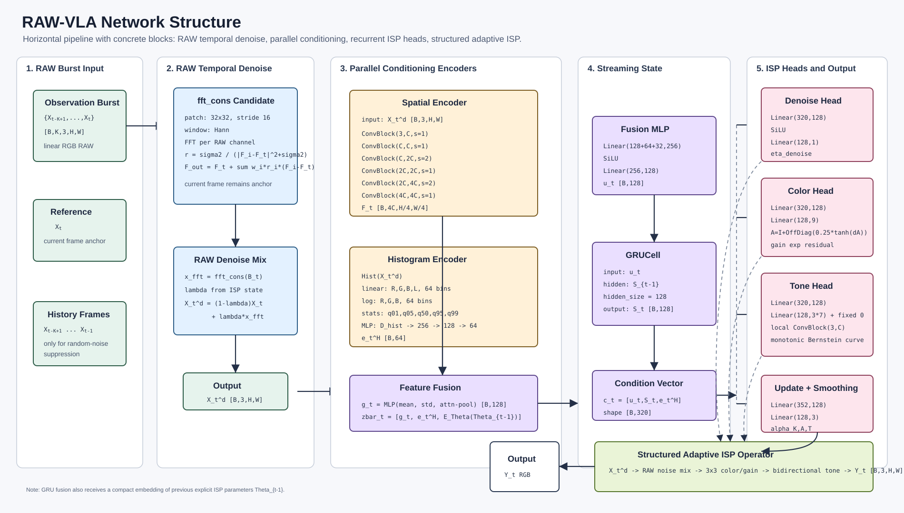

# RAW-VLA Network Structure

本文档给出 `baselines/rawvla` 的第一版可实现网络结构。目标是把已有两部分设计落到一个清晰的端到端 frontend:

1. **RAW-domain temporal denoise**: denoise 直接发生在 linear RGB RAW 上，以当前帧为 anchor，只使用历史 observation frames 抑制随机噪声。
2. **Streaming adaptive learnable ISP**: ISP 参数由当前 RAW、RAW histogram 和 recurrent ISP state 联合预测，输出供 VLA 使用的 RGB 图像。



## 0. ASCII Pipeline

下面是最直接的字符版结构。重点是 `Spatial Encoder` 和
`Histogram Encoder` 是两条并行分支，它们只在 `Concat/Fusion` 处连接。

```text
RAW observation burst
{X_{t-K+1}, ..., X_{t-1}, X_t}
        |
        v
+--------------------------------------------------+
| RAW Temporal Denoise                             |
| fft_cons(B_t), current frame X_t is the anchor   |
+--------------------------------------------------+
        |
        v
X_t^d  (denoised current RAW)
        |
        +-------------------------------+
        |                               |
        v                               v
+----------------------+        +-------------------------+
| Spatial Encoder      |        | RAW Histogram           |
| E_spatial(X_t^d)     |        | Hist(X_t^d)             |
|                      |        | linear / log / stats    |
| output: F_t          |        +-------------------------+
+----------------------+                    |
        |                                   v
        v                         +-------------------------+
+----------------------+          | Histogram Encoder       |
| Stats + Attn Pool    |          | E_hist(Hist(X_t^d))     |
| mean/std/attention   |          | output: e_t^H           |
| output: g_t          |          +-------------------------+
+----------------------+                    |
        |                                   |
        +---------------+-------------------+
                        |
                        v
              +-------------------+
              | Concat / Fusion   |
              | zbar=[z_t,eTheta] |
              +-------------------+
                        |
                        v
              +-------------------+
              | GRU ISP State     |
              | S_t=GRU(zbar,S_t-1)|
              +-------------------+
                        |
             +----------+----------+
             |                     |
             v                     v
   +-------------------+   +-------------------+
   | ISP Parameter     |   | Update Gate       |
   | Heads             |   | alpha_A,T         |
   | hat_Theta_t       |   +-------------------+
   +-------------------+             |
             |                       |
             +----------+------------+
                        |
                        v
              +----------------------+
              | Theta Smoothing      |
              | Theta_t=(1-alpha)    |
              | Theta_{t-1}+alpha    |
              | hat_Theta_t          |
              +----------------------+
                        |
                        v
+--------------------------------------------------+
| Structured Adaptive ISP                          |
|                                                  |
| X_t^d                                            |
|   -- Raw Noise Control / learned fft_cons merge  |
|   -- Scalar Exposure + fused WB/CCM 3x3 matrix   |
|   -- Bidirectional Tone Mapping                  |
|                                                  |
| output: Y_t                                      |
+--------------------------------------------------+
                        |
                        v
              VLA-facing RGB image
```

## 1. Input and Output

At time step `t`, the frontend receives a causal RAW burst:

```text
B_t = {X_{t-K+1}, ..., X_{t-1}, X_t}
X_i: [B, 3, H, W], linear RGB RAW, normalized to [0, 1]
```

The current frame `X_t` is always the reference. Historical frames are adjacent environment observations, not previous VLM query images.

The output is:

```text
Y_t: [B, 3, H, W], VLA-facing RGB
S_t: recurrent ISP hidden state
Theta_t: smoothed structured ISP parameters
```

Recommended first configuration:

```text
K = 3 or 4
input_format = rgb_raw
hist_bins = 64
state_dim = 128
spatial_width = 32 or 48
```

## 2. High-Level Pipeline

```text
RAW burst B_t
  -> RAW Temporal Denoise D_raw(B_t)
  -> denoised current RAW X_t^d
  -> two parallel branches:
       spatial branch:   E_spatial(X_t^d) -> F_t -> Pool_mean,std,attn(F_t) = g_t
       histogram branch: Hist(X_t^d) -> E_hist(.) -> e_t^H
  -> Fusion: z_t = concat(g_t, e_t^H)
  -> Previous ISP embedding e_{t-1}^Theta = E_Theta(Summary(Theta_{t-1}))
  -> Recurrent ISP State GRU([z_t, e_{t-1}^Theta], S_{t-1})
  -> ISP Parameter Heads
  -> Update Gate and Theta smoothing
  -> Structured Adaptive ISP
  -> RGB image Y_t for downstream VLA
```

The denoise module is intentionally before scalar exposure, fused WB/CCM, and
tone operations. This prevents low-light exposure/tone recovery from amplifying
raw sensor noise first and trying to remove it later.

Important: the spatial encoder and histogram encoder are **parallel**, not
serial. The histogram encoder does not consume `F_t`, and the spatial encoder
does not consume histogram bins. Their outputs meet only at the fusion vector:

```text
g_t   = Pool_mean,std,attn(E_spatial(X_t^d))
e_t^H = E_hist(Hist(X_t^d))
z_t   = concat(g_t, e_t^H)
```

The recurrent branch additionally receives a compact embedding of the previous
explicit ISP operating point. For the global-only v1, `Summary(Theta)` is the
vector of scalar-exposure, fused-WB/CCM, and tone controls. Burst merge strength
is fixed and therefore is not part of the recurrent descriptor. If local
parameter maps are enabled later, summarize them with channel-wise
spatial statistics rather than flattening full-resolution maps:

```text
p_{t-1}       = Summary(Theta_{t-1})
e_{t-1}^Theta = theta_encoder(p_{t-1})
zbar_t        = concat(z_t, e_{t-1}^Theta)
```

## 3. Module A: RAW Temporal Denoise

### 3.1 Role

The first version should implement the `fft_cons` design from `denoise.md`.

```text
X_t^d = D_raw({X_{t-K+1}, ..., X_t})
```

This module is not a CNN and not a post-ISP RGB filter. It performs conservative local frequency-domain merging on RAW observations:

```text
F_out = F_t + sum_i w_i * r_i * (F_i - F_t)
r_i = sigma2 / (abs(F_i - F_t)^2 + sigma2)
```

where `F_t` is the FFT of the current RAW patch and `F_i` is the FFT of a historical RAW patch.

### 3.2 Fixed Control

RAW-VLA uses a fixed historical-correction strength inside `fft_cons` and does
not predict it from the image or recurrent state.

```text
F_out = F_t + eta_denoise * sum_i w_i * r_i * (F_i - F_t)
r_i = sigma2 / (abs(F_i - F_t)^2 + sigma2)
X_t^d = overlap_add(IFFT(F_out))
```

where `eta_denoise = 0.5`. This preserves the burst + local FFT merge design
from `denoise.md` while removing the denoise head and its recurrent state.

Avoid adding a second image-space blend after `fft_cons`, because that only
rescales the same historical correction already controlled by the FFT merge
weights.

## 4. Module B: Spatial Encoder

The spatial encoder predicts content-aware ISP behavior without becoming a second VLA backbone.

Input:

```text
X_t^d: [B, 3, H, W]
```

Suggested lightweight backbone:

```text
Conv3x3(3, C, stride=1) + GN + SiLU
Conv3x3(C, C, stride=1) + GN + SiLU
Conv3x3(C, 2C, stride=2) + GN + SiLU
Conv3x3(2C, 2C, stride=1) + GN + SiLU
Conv3x3(2C, 4C, stride=2) + GN + SiLU
Conv3x3(4C, 4C, stride=1) + GN + SiLU
```

Outputs:

```text
F_t: [B, 4C, H/4, W/4]
g_mean = mean(F_t, dim=(-2, -1)): [B, 4C]
g_std  = std(F_t, dim=(-2, -1)):  [B, 4C]
a_t    = softmax(attn_score(F_t).flatten(2), dim=-1): [B, 1, H'W']
g_attn = weighted_sum(F_t, a_t): [B, 4C]
g_t    = pool_mlp(concat(g_mean, g_std, g_attn)): [B, 128]
```

Use `C=32` for a compact version or `C=48` if the ISP heads need more local detail.

## 5. Module C: RAW Histogram Encoder

Compute the histogram from `X_t^d` or from both `X_t` and `X_t^d`. The minimal version uses `X_t^d`.

Descriptor:

```text
h_t = [
  linear hist: R, G, B, luminance,
  log hist:    R, G, B,
  quantiles:   q01, q05, q50, q95, q99,
  ratios:      dark_ratio, clip_ratio
]
```

Suggested shape with `hist_bins=64`:

```text
linear hist: 4 * 64 = 256
log hist:    3 * 64 = 192
stats:       about 7-16
total:       about 455-464
```

Encoder:

```text
MLP(input_dim, 256) + SiLU
MLP(256, 128) + SiLU
MLP(128, D_h)
```

Recommended:

```text
D_h = 64
```

## 6. Module D: Streaming ISP State

Fuse pooled spatial feature and histogram embedding:

```text
z_t = concat(g_t, e_t^H)
```

Encode and append the previous explicit ISP operating point:

```text
p_{t-1}       = Summary(Theta_{t-1})
e_{t-1}^Theta = E_Theta(p_{t-1})
zbar_t        = concat(z_t, e_{t-1}^Theta)
```

Update recurrent ISP state:

```text
S_t = GRUCell(zbar_t, S_{t-1})
```

Recommended:

```text
state_dim = 128
```

`S_t` should represent residual temporal information about recent imaging
conditions, not object memory and not a duplicate of `Theta_t`. It is allowed
to track:

- recent exposure level;
- low-light noise tendency;
- clipping/shadow ratios;
- speed of illumination change;
- illumination/noise trends not recoverable from the current frame alone;
- hysteresis that separates transient fluctuations from persistent changes.

The previous tone, scalar-exposure, and fused-WB/CCM operating point is
represented explicitly by `Theta_{t-1}` and enters the GRU through
`e_{t-1}^Theta`.

## 7. Module E: ISP Parameter Heads

Predict structured parameter groups instead of directly synthesizing an RGB image.

```text
hat_Theta_t = {
  theta_A: scalar-exposure and fused-WB/CCM controls,
  theta_T: tone controls
}
```

The first implementation can mirror the layer granularity of
`baselines/darkisp` while changing the conditioning and operator definitions.
Dark-ISP has:

```text
raw_packed4
  -> DynamicLinearMapping
       local ConvBlock path  -> pixel-level matrix residual
       global ConvBlock path -> image-level matrix residual
  -> PolynomialToneMapping
       ConvBlock path -> per-pixel polynomial coefficients
```

RAW-VLA keeps the same principle:

```text
rgb_raw burst
  -> RAW temporal denoise with fixed eta_denoise=0.5
  -> Spatial/Histogram/State conditioning
  -> Structured ISP heads
       color head   -> global 3x3 + optional local residual
       tone head    -> low-light and highlight tone coefficients
```

The main difference is that RAW-VLA predicts ISP parameters from both current
image content and streaming exposure state, instead of predicting only from the
current image.

## 7.1 Concrete v1 Layer Spec

This is a concrete network structure close enough to implement directly in
PyTorch. Use the same basic block style as `darkisp.py`:

```text
ConvBlock(in_ch, out_ch, stride):
  Conv2d(in_ch, out_ch, kernel_size=3, stride=stride, padding=1)
  GroupNorm(num_groups=1, num_channels=out_ch)
  SiLU
```

### 7.1.1 Shared Spatial Encoder

Input:

```text
x_pred: [B, 3, H, W]
```

Layers:

```text
spatial_stem:
  ConvBlock(3, C, stride=1)       -> [B, C, H, W]
  ConvBlock(C, C, stride=1)       -> [B, C, H, W]

spatial_down1:
  ConvBlock(C, 2C, stride=2)      -> [B, 2C, H/2, W/2]
  ConvBlock(2C, 2C, stride=1)     -> [B, 2C, H/2, W/2]

spatial_down2:
  ConvBlock(2C, 4C, stride=2)     -> [B, 4C, H/4, W/4]
  ConvBlock(4C, 4C, stride=1)     -> [B, 4C, H/4, W/4]
```

Outputs:

```text
F_t = [B, 4C, H/4, W/4]
```

Statistics-and-attention pooling:

```text
attn_score:
  Conv2d(4C, 1, kernel_size=1, bias=True)

g_mean = mean(F_t, dim=(-2, -1))                  # [B, 4C]
g_std  = sqrt(mean((F_t - g_mean)^2) + 1e-6)     # [B, 4C]
a_t    = softmax(attn_score(F_t).flatten(2), -1)  # [B, 1, H'W']
g_attn = sum_p(a_t(p) * F_t(p))                   # [B, 4C]

pool_mlp:
  Linear(12C, 256)
  SiLU
  Linear(256, 128)
  SiLU

g_t = pool_mlp(concat(g_mean, g_std, g_attn))     # [B, 128]
```

Initialize `attn_score` weights and bias to zero so attention starts uniform.
At initialization, `g_attn` therefore equals `g_mean`; training can gradually
learn to emphasize small salient regions without destabilizing the initial ISP.

Recommended:

```text
C = 32
```

### 7.1.2 Histogram Encoder

Input:

```text
h_t: [B, D_hist]
```

Layers:

```text
hist_mlp:
  Linear(D_hist, 256)
  SiLU
  Linear(256, 128)
  SiLU
  Linear(128, 64)
```

Output:

```text
e_t^H = [B, 64]
```

### 7.1.3 Fusion and Recurrent State

Input:

```text
z_t           = concat(g_t, e_t^H) = [B, 128 + 64]
p_{t-1}       = Summary(Theta_{t-1}) = [B, D_theta]
e_{t-1}^Theta = theta_encoder(p_{t-1}) = [B, 32]
zbar_t        = concat(z_t, e_{t-1}^Theta) = [B, 128 + 64 + 32]
```

Layers:

```text
theta_encoder:
  Linear(D_theta, 64)
  SiLU
  Linear(64, 32)
  SiLU

fusion_mlp:
  Linear(224, 256)
  SiLU
  Linear(256, 128)
  SiLU

state_gru:
  GRUCell(input_size=128, hidden_size=128)
```

Outputs:

```text
u_t = fusion_mlp(zbar_t) = [B, 128]
S_t = GRUCell(u_t, S_{t-1}) = [B, 128]
```

For the recommended global-only v1, `D_theta` is the flattened size of the
constrained global controls (scalar exposure, fused WB/CCM color matrix, and
global tone coefficients). `Summary` must use the same
normalized parameterization as the heads so that identity initialization has a
stable, known descriptor.

The concrete recurrent descriptor has `D_theta = 30`: one scalar exposure EV,
two independent relative-WB coordinates, six
off-diagonal CCM residuals, and 21 identifiable global tone logits. The WB and
CCM controls are composed into one scale-free `3 x 3` matrix before
application. Local color/tone maps are current-frame residuals and are not
retained in `Theta_t`.

### 7.1.4 Fixed Burst Merge

There is no denoise-control head. The RAW-domain operator uses a constant:

```text
x_d = fft_cons(raw_burst, eta_denoise=0.5)
```

Optional local detail map:

```text
detail_map:
  ConvBlock(4C, 2C, stride=1)
  Conv2d(2C, 1, kernel_size=1)
  Sigmoid
  Upsample(scale_factor=4, mode="bilinear")
```

### 7.1.5 Dynamic Color Mapping Head

This is the RAW-VLA analogue of Dark-ISP's dynamic linear mapping, but for
three-channel linear RGB RAW.

Global branch:

```text
color_global:
  Linear(320, 128)
  SiLU
  Linear(128, 9)
```

Outputs:

```text
exposure_global: [B, 1]
wb_relative:     [B, 2]
delta_C_offdiag: [B, 6]
```

Parameterization:

```text
exposure_gain = 2 ** (4 * tanh(exposure_global))
delta_wb = bounded_zero_sum_log_wb(wb_relative, max_abs_ev=1.0)
W_global = diag(2 ** delta_wb)                 # det(W_global) = 1
C_global = I_3 + OffDiag(0.25 * tanh(delta_C_offdiag))
M_global = C_global @ W_global                 # fused WB/CCM matrix
```

The zero-sum log-WB constraint removes common exposure scale from the fused
color matrix. Fixing `diag(C_global) = 1` assigns diagonal color scale to the
relative WB term while retaining all six cross-channel mixing directions. The
identity-centered scalar exposure spans `1/16x`--`16x`, which is wide enough
for extreme low light; `Summary(Theta)` stores it as normalized EV,
`log2(exposure_gain) / 4`.

Optional local branch, following the same idea as Dark-ISP's local residual
matrix:

```text
color_local:
  ConvBlock(4C, 2C, stride=1)
  ConvBlock(2C, 2C, stride=1)
  Conv2d(2C, 9, kernel_size=1)
  Tanh
  Upsample(scale_factor=4, mode="bilinear")
```

Local matrix:

```text
M_local(p) = 0.05 * color_local(F_t)(p)
M_local(p) = project_out_common_scale(M_local(p))
M_t(p) = M_global + M_local(p)
```

For the first stable version, use only `M_global` and the scalar exposure gain.
Add `M_local` after the global version is stable.

Application:

```text
z_t_rgb(p) = exposure_gain * (M_t(p) @ x_d(p))
```

### 7.1.6 Monotonic Bidirectional Tone Mapping Head

The tone operator uses an eighth-order monotonic Bernstein curve. It supports
both shadow lifting and highlight compression while guaranteeing that intensity
ordering is preserved.

Global coefficient branch:

```text
tone_global:
  Linear(320, 128)
  SiLU
  Linear(128, 3 * 7)
```

Outputs:

```text
tone_relative_logits: [B, 3, 7]
```

Optional per-pixel interval-logit branch, similar to Dark-ISP's coefficient
conv:

```text
tone_local:
  ConvBlock(3, C, stride=1)
  ConvBlock(C, C, stride=1)
  Conv2d(C, 3 * 7, kernel_size=3, padding=1)
```

Combine the bounded local correction with the recurrent global logits:

```text
l_free_t(p) = tone_relative_logits + 0.5 * tanh(tone_local(z_t_rgb)(p))
l_t(p) = concat(l_free_t(p), 0)
delta_p_t(p) = softmax(l_t(p), dim=interval)
```

The fixed eighth reference logit removes softmax's common-offset null
direction. There are still eight positive increments and an eighth-order
Bernstein curve, but only seven independent logits per channel.

Construct ordered control points:

```text
p_0(p) = 0
p_k(p) = sum_{j=1}^k delta_p_j(p),  k = 1..8
```

The tone output is the Bernstein polynomial:

```text
Y_t = sum_{k=0}^8 p_k * C(8,k) * z_t_rgb^k * (1-z_t_rgb)^(8-k)
Y_t = clamp(Y_t, 0, 1)
```

Because `delta_p_k > 0`, the control points are ordered and the curve is
monotonic. Zero-initialized global/local logits give `p_k = k/8`, which makes
the initial tone operator exactly identity.

The default v1 uses only the global curve, which gives a single monotonic
mapping for the whole image. Enabling the local branch keeps each conditioned
per-pixel curve monotonic, but does not guarantee intensity ordering between two
different pixels because they may receive different curves.

### 7.1.7 Update Gate Head

The update gate predicts how quickly each parameter group changes.

Input:

```text
gate_t = concat(g_t, e_t^H, e_{t-1}^Theta, S_t) = [B, 352]
```

Layers:

```text
update_gate:
  Linear(352, 128)
  SiLU
  Linear(128, 2)  # legacy; split uses 3 for exposure/chroma/tone
  Sigmoid
```

Outputs:

```text
alpha_A: scalar-exposure and fused-WB/CCM controls
alpha_T: tone controls
```

Smoothing:

```text
Theta_t^A = (1 - alpha_A) * Theta_{t-1}^A + alpha_A * hat_Theta_t^A
Theta_t^T = (1 - alpha_T) * Theta_{t-1}^T + alpha_T * hat_Theta_t^T
```

Zero-initialize the last layer biases so initial `alpha` is moderate or slow,
for example:

```text
b_alpha = -2.0  # sigmoid ~= 0.12
```

### 7.2 Raw Noise/Detail Operator

`fft_cons` remains a deterministic, differentiable RAW operator. Its
historical-correction strength is fixed to `eta_denoise = 0.5`; reliability
weights still suppress inconsistent history at each frequency.

### 7.3 Exposure and Fused WB/CCM Head

Predict a scalar exposure and a stable, scale-free residual over an identity
WB/CCM matrix:

```text
exposure_gain = 2 ** (4 * tanh(exposure_raw))
M_t = compose_wb_ccm(wb_relative, ccm_offdiag)
Z_t(p) = exposure_gain * M_t * X_t^d(p)
```

Recommended:

```text
exposure_raw: [B, 1]
wb_relative: [B, 2]
ccm_offdiag: [B, 6]
ccm_offdiag_scale = 0.25
```

Optional local residual:

```text
M_t(p) = M_global + local_residual(F_t)
```

For v1, prefer one scalar exposure gain plus one global fused `3x3` WB/CCM
matrix. This keeps the large `+/-4 EV` range achromatic while retaining the
eight scale-free color degrees of freedom.

### 7.4 Tone Head

Use the monotonic Bernstein parameterization from Section 7.1.6. Ordered
control points above the identity diagonal lift shadows; points below the
diagonal compress highlights. A single curve can cross the diagonal to produce
an exposure-adaptive S-curve without a separate low/high selector.

## 8. Module F: Parameter Update Gate

Predict adaptation rate for each parameter group:

```text
alpha_A, alpha_T = sigmoid(MLP([z_t, e_{t-1}^Theta, S_t]))
```

Smooth candidate parameters:

```text
Theta_t^A = (1 - alpha_A) * Theta_{t-1}^A + alpha_A * hat_Theta_t^A
Theta_t^T = (1 - alpha_T) * Theta_{t-1}^T + alpha_T * hat_Theta_t^T
```

This is better than fixed temporal smoothing because stable illumination can use small `alpha`, while sudden exposure changes can use large `alpha`.

Initialization:

```text
Theta_0:
  eta_denoise = 0.5  # compatibility/output field, not predicted
  A = identity
  tone = identity-like coefficients
S_0 = zeros
```

Candidate-head and update-gate final weights use a small random initialization
(`std = 1e-3`) instead of exact zeros, so the first task-loss backward pass can
reach their preceding MLPs and the shared encoder/GRU. Neutral biases are kept
for color and tone. The validated FFT reliability scale and history weights
remain those of the `frequency_burst_merge` probe; the global correction
multiplier is always `0.5`.

## 9. Structured Adaptive ISP Forward

A practical v1 forward pass uses the unmodified current RAW anchor to predict
only the color/tone operating point:

```text
def forward(raw_burst, state=None, theta_prev=None):
    x_ref = raw_burst[:, -1]

    if theta_prev is None:
        theta_prev = neutral_theta(batch_size=x_ref.shape[0])
    if state is None:
        state = zeros(batch_size=x_ref.shape[0], dim=128)

    # Predictor input uses the unmodified current RAW anchor.
    x_pred = x_ref
    h_pred = raw_histogram(x_pred)
    f = spatial_encoder(x_pred)
    e_h = hist_encoder(h_pred)
    g = stats_attention_pool(f)  # mean + std + learned attention -> [B, 128]

    theta_summary = summarize_theta(theta_prev)
    e_theta_prev = theta_encoder(theta_summary)
    z = concat(g, e_h)
    u = fusion_mlp(concat(z, e_theta_prev))
    s = gru(u, state)
    theta_hat = isp_heads(f, e_h, s)
    alpha = update_gate(g, e_h, e_theta_prev, s)
    theta = smooth(theta_hat, theta_prev, alpha)

    # Burst correction is deterministic; RAW-VLA does not predict its strength.
    x_d = fft_cons(raw_burst, eta_denoise=0.5)
    z = apply_exposure_wb_ccm(x_d, theta.exposure, theta.color)
    y = apply_bidirectional_tone(z, theta.tone)

    return y, s, theta
```

The simple v1 above is easier to implement and debug because parameter
prediction is driven by the unmodified current RAW anchor, while the denoise
stage remains a single current-frame-anchored FFT merge.

## 10. Training Objective

The frontend should be primarily task-driven:

```text
L_task = VLA action loss / imitation loss
```

The only ISP-specific auxiliary loss is computed on the final ISP RGB, per
image rather than over the whole batch:

```text
m_b = mean over C,H,W of Y_isp[b]
d_b = relu((0.48 - m_b) / 0.48)
L_exp = mean_b(d_b ** 4)
L = L_task + lambda_exp * L_exp
```

Start with `lambda_exp = 0.01`. No exposure label or low-light mask is needed:
the fourth power makes the relative gradient much stronger for extremely dark
outputs and makes it rapidly vanish near the LIBERO mean prior. Do not add
Grey-World, clean-image reconstruction, clipping, or tone-identity losses in
this version.

## 11. Implementation Milestones

1. Implement deterministic `fft_cons` RAW temporal merge and identity fallback.
2. Implement histogram descriptor and histogram encoder.
3. Implement spatial encoder, GRU state, parameter heads, and update gate.
4. Implement scalar exposure plus the global fused WB/CCM matrix and bidirectional tone mapping.
5. Fix `eta_denoise=0.5` inside `fft_cons` and exclude it from prediction/state.
6. Train/evaluate with frozen VLA first, then optionally jointly tune the frontend.

## 12. Key Design Decisions

- Denoise is performed on RAW before exposure/WB/CCM/tone.
- The current frame remains the spatial anchor; history only supplies conservative noise correction.
- ISP is structured and low-dimensional, not an unrestricted image-to-image network.
- Histogram conditioning handles exposure regime; spatial features prevent histogram-only mistakes.
- Recurrent state stabilizes the ISP over streaming observations.
- Update gates allow fast adaptation only when the imaging condition actually changes.
> **Validated default after V1--V5 (2026-08-21).** The implementation now uses
> camera-adjacent `K=6` bursts and policy-cadence `T=6` recurrent windows; equal
> luminance `(R+G+B)/3`; independent 64-d luminance and 64-d scale-invariant
> chroma GRUs; scalar exposure `2 ** (6*tanh(raw))`; a shared achromatic tone
> curve; fused `CCM @ diag(relative_WB)` color; and fixed update `alpha=1`.
> Training uses frozen-backbone action loss, two-sided mean L1 (`target=.48`,
> `weight=.01`) through an STE clamp, and an unpaired chroma-envelope loss
> (`weight=.001`, 10% margin). Paired default-lighting RGB is evaluation-only.
> Older `v1`/learned-gate passages below document the design evolution and are
> not the current default.
